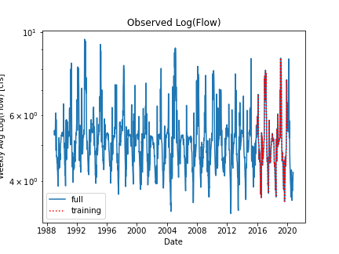

# ***Benjamin Mitchell's Code (Bensketball)***
## `10/18/2020`
## Code Submission  #1

___
<a name="grd"></a>
### ***Grade***
You can find the rubric [here!](https://github.com/HAS-Tools-Fall2020/Course_Materials/blob/master/Assignments/Starter_Codes/assets/code_review_rubric-ff0ecab3.png)

 - 6/6  Great  job!
 - Readability: 2
 - Style: 3 
 - Code: 3

 - Really nice work. I like your function and how you able to do your 16 week forecast so cleanly. 
 - Next time just add docstrings. 


___
### Table of Contents:
0. [ Grade](#grd)
1. [ Questions](#qns)
2. [ My Python Code(s)](#cod)
3. [ Appendices & Graphs](#apd)
4. [ Works Cited](#cit)

##### Given to Partner last week:
5. [ Instructions](#ins)
6. [ Partner's Code Review](#rev)

___
<a name="qns"></a>
## Assignment Questions
1. A brief summary of the AR model you built and why. Use whatever graphs you find helpful.

  **Ans:**

  `In this AR model, the log of flow was used to predict future flow rather than directly using the flow data.  This was done because I found that the simulated flow got closer to modeling the real flow values when using log of flows.  This increased my coefficient of determination to '0.776843' where before it was stuck under 0.70.  Whether this increases the accuracy of the model remains to be seen.
  `

2. An explanation of how you generated your forecasts and why (i.e. did you use your AR model or not?)

  **Ans:**

  `I used the AR predictions, as my predictions, to better understand the function I created and make it run smoother for the 16 week predictions.  I am really interested in understanding GUI's and the presentation of data with the click of a button. :)  With my function, I was able to produce my 2 week predictions and my 16 week predictions.  I wanted to use the models predictions because I am proud of my function.
  `

3. A brief summary of what you got out of the peer evaluation. How did you make your script better?

  **Ans:**

  `Camilo gave me a lot of help with my code!  He had great ideas for how to better my code and I took most of his ideas.  As a result, my function's output is much more readable.  I included his review of my code at the bottom if you needed it for reference.  There is an error that comes up in my code every other time it has been run and I have not been able to solve it.  I believe it to be something to do with overwriting the data frame that then fixes itself once run a second time.  My instructions to Camilo includes the problem.  The oscillation of the error is interesting.
  `

  `Anyway, Camilo did such a great job!  His review was thorough and clear so I could fix what needed to be fixed with little difficulty.
  `

4. Describe the part of your script that you are most proud of and why.

  **Ans:**

  `If I had to choose I would say my function works like a dream.  You give it the weeks to want to predict out, a known weekly average flow you want to start your predictions with and a list of dates these predictions are for.  The output will print you a data frame with the predicted values with the respected weeks the predictions are for as the indexes.
  `

___
<a name="cod"></a>
## My Python Code(s):

##### The Python code can be found [here](mitchell_HW8.py).  It can also be found the folder you downloaded.  It was derived from this code [here](../../Orig_Starter_Codes_BM/week6_matplotlib_starter.py).

___
<a name="apd"></a>
## Appendices & Graphs
Here are all the charts created with my code (there are a lot of them):




___
<a name="cit"></a>
## Works Cited:

[My estimate,](https://github.com/HAS-Tools-Fall2020/forecasting/blob/master/forecast_entries/mitchell.csv) given in row 5 of *mitchell.csv*, was estimated by the creation and application of the python code presented above.  The data used for this estimate was obtained via the USGS NWIS [mapper](https://maps.waterdata.usgs.gov/mapper/) for the gage number 09506000.

___
___
<a name="ins"></a>
# **Instructions**
## How to run my code:
`Run my code! Done!
`
Just kidding, I can walk you through what I have created here.

First off, the folder you copied to your computer should be the folder titled 'Code_Review1' found in my 'Submissions' folder of GitHub Repo.  Contained in this folder is my python code title 'mitchell_HW7.py' via the instructions on GitHub.  There should also be an empty folder called graphs and an empty The website to this GitHub can be found [here](https://github.com/HAS-Tools-Fall2020/homework-Bensketball/tree/master/Submissions/Code_Review1).  If you go to this website, you will find many helpful links to run my code.  The steps are below:

###### Step #1:
Download the daily streamflow data for station *09506000 Verde River Near Camp Verde* from the USGS NWIS [mapper](https://maps.waterdata.usgs.gov/mapper/).  Make sure your click the 'Daily Data' link after selecting the gage number so that the model is up to date with the latest data to help make the short term forecasts.
   - Parameter 00060 Discharge (mean)
   - Start date = 1989-01-01
   - End date = 2020-10-10 (Saturday this week)
   - Select 'tab separated'

Save a text file in the folder titled 'data' and title this text file 'streamflow_week7.txt'.  The name chosen is critical to my code.

P.S. There is already a text file titled 'streamflow_week7_temp.txt' in the 'data' folder.  This text file is missing this Friday and Saturday.  This is why you are updating the data. :)

###### Step #2:
Run my code.  Make sure that the filename in the beginning reads like this:
```python
filename = 'streamflow_week7.txt'
filepath = os.path.join('data', filename)
print(os.getcwd())
print(filepath)
```

Also, there is something weird about my code that I should warn you about.  You may get an error that reads like the output below:
```python
~\miniconda3\envs\hastools\lib\site-packages\scipy\linalg\basic.py in lstsq(a, b, cond, overwrite_a, overwrite_b, check_finite, lapack_driver)
   1221             raise LinAlgError("SVD did not converge in Linear Least Squares")
   1222         if info < 0:
-> 1223             raise ValueError('illegal value in %d-th argument of internal %s'
   1224                              % (-info, lapack_driver))
   1225         resids = np.asarray([], dtype=x.dtype)

ValueError: illegal value in 4-th argument of internal None
```
If you get this type of error, just run the code a second time.  I have been getting this error every other time I run my code, but it seems to fix itself every time I run it a second time.  I hope it does not effect your ability to use the code.

~ Thank you!  Please grade my code in the section below:
___
<a name="rev"></a>
### Your Code Review
##### Fill in the question(s) below from GitHub assignment.
##### *Feel free to change up this space for your review of my code!  You do not need to follow my formatting.

1. First check below to see who your partner is.

2. Clone their repo to your computer. You can find their repo by going to the [main GitHub organization page](https://github.com/HAS-Tools-Fall2020) for this class.

3. Review their code following the code_review_rubric.md instructions in the starter_codes folder. You should provide your comments and scores in the spaces they have provided for you in their ReadMe.md file in the Code_Review1 folder of their GitHub submissions folder.

  This is the space provided.  Feel free to change up this space for your review of my code!  You do not need to follow my formatting.

  **Code Review by Camilo Salcedo**

  Hi Ben. Thank you for your straightforward and complete instructions. You can find my review for your code below, and the forecasted values in the section you defined also below. It was very nice to review your code :) .

  *General Comments*

  - The instructions you sent me were pretty straightforward and complete. Moreover, they included the solution to every possible error that would come out when running the code.

  - Your code runned easily, and the forecast values were given explicitely through a print statement.

  - Your approach of analyzing the log of data rather than the raw data seems very promising.

  - The resulting graphs gave additional information to the forecast results, and they were nice.

  - PEP8 standards were respected along the code.

  - You created a function to perform the forecasts, using the use of a loop, which was really good. However, you didn't use the corresponding doc-strings to documentate the function.

  - In your code, I changed your datafile name to ''streamflow_week7.txt' in line 22 according to your instructions. In addition, I created the folder _graphs_ because it didn't exist in your Submissions folder.

  *Additional Ideas and Improvement Opportunities in Coding*
  Some ideas and tips that could help you to improve your code are described below:

  -  The comments you used in your code were very helpful. However, be careful with the spelling. You can find below a list of some spelling mistakes I found on your comments.

  Line 3: Perdiction
  Line 100: altrenatievely
  Line 100: calcualte
  Line 168: follwed
  Line 172: useing
  Line 172: fuction
  Line 184: becuase

  - Most of your variables were expressive, and followed PEP8 standards in the use of lower cases and underscores. Be careful with using short names like _pred_ (line 178), because out of context it should not be as expressive as required.

  In addition, when you use variables in a loop, you could use more expressive varibles.

  As an example, in line 170 you defined the variable _week_before_ to represent the mean flow of the previous week. Then, when you started the loop, you used the variable _week_bef_ to save the temporal values along the cycle. My recommendation is to use a name that tells the reader that this will be a temporal variable to be used within a loop. A good example could be _week_before_iter_ or _week_before_i_.

  - When creating a function, don't forget to use the doc-strings to documentate the function. As an extra benefit for your code-users, if they are lost with the use of your function, they could use _help_ to display your doc-strings and understand it better.

  - Be careful with white spaced recommended by PEP8 standards. For example, when you used a comment of one single line, you should leave a white space before it. This didn't occur in line 172.

  - When using Auto Regressive models, it is important to let the user know how many shifts did you use. As a recommendation, this could be a nice print to add to your code.

  - *Suggestion*: In the code block between lines 69 and 75, you could extract the training period by using directly the start date and the end date of your period as strings rather than indexes.

  To achieve this, you could use the format 'YYYY-MM-DD', and the loc function of dataframes. As an example, you could use either of the following lines:

  train = flow_weekly.loc['2013-12-01':'2019-08-25']
  train = flow_weekly['2013-12-01':'2019-08-25']

  In this way, you don't have to spend time looking for the indexes that correspond to the dates you want to use as training period.

  - *Suggestion*: In your function to make the predictions, you could save the forecasted values to use them in further postprocessing exercises such as graphs. In this sense, you could save them either within a new array of forecasted values, or as part of your dataframe.

  If you want to save them as part of your dataframe, the first thing you could do is to create a list of dates as strings, corresponding to the weeks you are going to include in your forecast. As an example:

  forecast_week=['2020-10-19','2020-10-26','2020-11-02']

  Then, using the _append_ function, you can add the most recent forecast to your dataframe. The code should look as follows:

  flow_weekly.append(pd.Series({'flow':pred},index=flow_weekly.columns, name=forecast_week[i]))

  Where _i_ corresponds to the index you used in the loop, and _pred_ to the variable in which you perform the forecast.

  *Review Rubric*

| *Criteria*     | *Points* | *Comments*                                                                                                                   |
| -------------- | -------- | ---------------------------------------------------------------------------------------------------------------------------- |
| *Readability*  | 2        | You didn't use any Doc-strings. For the rest, your code was very readable.                                                   |
| *Style*        | 3        | You used PEP8 Standards. Please take a look on some minor situations in which PEP8 were not used accurately described above. |
| *Code Awesome* | 3        | Your code was succint, clean and pretty easy to understand and execute.                                                      |


4. Follow the instructions they have provided in their ReadMe.md file to run their script and generate their 4 forecast values.

5. Enter all four values (the two regression forecasts and the two forecast values into the ReadMe.md file of your partners repo.

  My regression forecasts are the same as my forecast values!  Please just right each number twice. :)

  ***Regression Forecasts:***

|          | *Regression Forecasts* | *Forecast Values* |
| -------- | ---------------------- | ----------------- |
| *Week 1* | 70.38075136717578      | 70.38             |
| *Week 2* | 77.9522111429154       | 77.95             |


_*Ben: I rounded your forecast to two decimal places.*_

6. Enter the two forecast values into the lastname.csv file for your partner. Remember you are entering their forecast for them this week, not your own!

My excel is titled *'mitchell.csv'*.  It can be found [here](https://github.com/HAS-Tools-Fall2020/forecasting/tree/master/forecast_entries) or [here](https://github.com/HAS-Tools-Fall2020/forecasting/blob/master/forecast_entries/mitchell.csv) for your convenience.

Finally, if the code works there should be a graph below:


###### ~Thank you!
