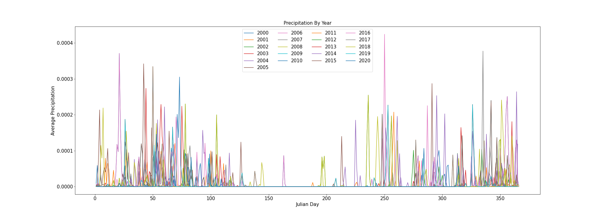
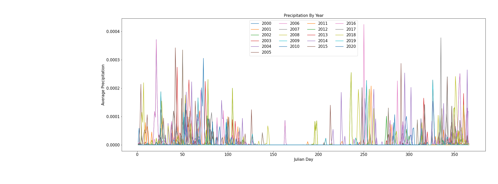

# Benjamin Mitchell
## `11/22/2020`
## Homework #12

___

### ***Grade***
3/3 - Nice work!

___
### Table of Contents:
0. [ Grade](#grd)
1. [ Questions](#qns)
2. [ Discharge Estimation](#est)
3. [ Python Code(s)](#cod)
4. [ Works Cited](#cit)

___

## Assignment Questions

1. A brief summary of the how you chose to generate your forecast this week.

**Ans:**
`I already did my forecast for this week back on 11/15.  I chose to use my Autoregressive Model, which I continue to improve on each week.
`

2. A description of the dataset you added
- What is the dataset? Why did you choose it?
- What is the spatial and temporal resolution and extent of the data ?
- Where did you get the data from?
- What was your approach to extracting and aggregating it into something useful to you?

**Ans:**
`I chose to use the 'Historical Reanalysis data' because I was having trouble receiving the data for the 'Precipitation forecast data'.  I was not able to receive the data via my email.  This data set has a Latitude and a Longitude associated with the dataset, giving the NetCDF a spatial and temporal aspect.  I got the data from the website printing below.  It is from the Physical Sciences Laboratory website which is using their 'NOAA 50th Anniversary Logo' at the moment.  Finally, my 'approach' to using and manipulating the data is covered in the following paragraph.
`

Physical Sciences Laboratory:
https://psl.noaa.gov/cgi-bin/db_search/SearchMenus.pl

`I wanted to compare/contrast the different years of precipitation by using a line plot using the data I received as NetCDF from the Physical Sciences Laboratory website.  I was able to convert the NetCDF into my favorite data type, a Pandas data frame.  After getting the data into a working format, I created many data frames that allowed me to plot my ultimate plot which can be found below.  Now you can see how the precipitation changes from year to year.  I did find that my chart was a bit off centered and had some extra white space on the left side.  It is unclear so far why 'plt.tight_layout()' does this sort of this to some graphs, but not others.  I decided to show off my graph without using 'plt.tight_layout()'.
`

[Fig1.1 - Final Product]

3. A plot of the dataset you added. This can be a timeseries, map, histogram or any other plot that you think is a good summary of what you added.

[Fig1.2 - Without 'plt.tight_layout()']

[Fig1.3 - With 'plt.tight_layout()']

___

## Estimation12 Explanation

I already did my forecast for this week back on 11/15.  I chose to use my Autoregressive Model, which I continue to improve on each week.

___

## My Python Code(s)6:

The Python Code, created in Visual Studio Code (VSC), can be found [here](Mitchell_week12.py).  This python code was crafted from the original Starter code given [here](../../Orig_Starter_Codes_BM/Week12_Reanalysis_Netcdf_starter.py).

___

## Works Cited:

[My estimate,](https://github.com/HAS-Tools-Fall2020/forecasting/blob/master/forecast_entries/mitchell.csv) given in row 5 of *mitchell.csv*, was estimated by the creation and application of the python code presented above.  The data used for this estimate was obtained via the USGS NWIS [mapper](https://maps.waterdata.usgs.gov/mapper/) for the gage number 09506000.
###### ~Thank you!
