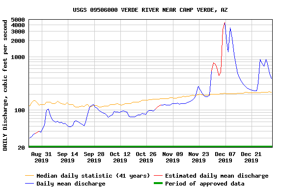

# Benjamin Mitchell
## `8/30/2020`
## Homework #1

### Table of Contents Test:
1. [ Discharge Estimation](#est)

___

## Estimation Explanation

For my first estimate, I decided to utilize the graph below:
___

___
As said, [my estimate](https://github.com/HAS-Tools-Fall2020/forecasting/blob/master/forecast_entries/mitchell.csv) titled *mitchell.csv* utilized only the orange-colored line, *Median daily statistical (41 years)*, presenting in the graph above.  The graph goes from 07/31/2019 to 12/31/2019, the period of interest in making future predictions.  The data graphed and represented here was obtained via the USGS NWIS [mapper](https://maps.waterdata.usgs.gov/mapper/) for the gage number 09506000.  Thank you!
___
## Grade:
3/3 Nice work! (just next time get it in by noon on Monday:) )
___
I plan on it! Thank you for full points and understanding! :D

`~BM`
