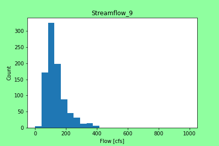

# Benjamin Mitchell
## `9/15/2020`
## Homework #4

___

# ***Grade***

___
### Table of Contents:
0. [ Grade](#grd)
1. [ Questions](#qns)
2. [ Discharge Estimation](#est)
3. [ Python Code](#cod)
4. [ Works Cited](#cit)

___

## Assignment Questions

###### The Python code used to answer the questions below can be found [here](../assignment_4/week4_questions_BM.py).

1. Include discussion of the quantitative analysis that lead to your prediction. This can include any analysis you complete but must include at least two histograms and some quantitative discussion of flow quantiles that helped you make your decision.

**Ans:**
Look [ here](#est) for an answer to this question.

2. Describe the variable flow_data:
- What is it?
- What type of values is composed of?
- What is are its dimensions, and total size?

**Ans:**
`(a) It is a 'Numpy Array'.
(b) The dtype is 'float64'.
(c) Its size is '46340' and its shape is '(11585, 4)'.
`

3. How many times was the daily flow greater than your prediction in the month of September (express your answer in terms of the total number of times and as a percentage)?

**Ans:**
`Last week?  It depends heavily on the prediction number/week.  For last week, my prediction was: '50.7'.  Based on my code, the number of times the daily flow was greater than my prediction in the month of September was 936 times out of 949 times.  That is a percentage of 98.63%.
`

4. How would your answer to the previous question change if you considered only daily flows in or before 2000? Same question for the flows in or after the year 2010? (again report total number of times and percentage)

**Ans:**
`For last week, my prediction was: '50.7'.  Using a version of my early code, for in or before 2000, in September, my percentage went from 98.63% to 100% of flows being greater than last week's prediction.  It was 360 over 360 data points.  For in or after 2010, in September, my percentage went from 98.63% to 96.87%!  It was 309 over 319 data points.  This tells me that the flows has been lower in recent years rather than more historical years.  Also makes sense because I have been using more recent data to make my estimates than much older data.  Flow of the times, if you will.
`

5. How does the daily flow generally change from the first half of September to the second?

**Ans:**
`
`

___

## Estimation4 Explanation

For this weeks estimate (4), I decided to use and transform a prewritten python code using Visual Studio Code.  The python code section I wrote, allowed me to create serval histograms for all data under the flow of 400 and in the months September, October, November, and December.  By isolating this part of the total data ('flow_data'), I was able to run computations to make my predictions.  For my estimate, I took the mean of all the data in each month and also took the lowest value I could find in each months given histogram.  For example look at the chart below:

As you can see, in September, the smallest "bin" filled in with data is from 0 to 40.  I took the flow 40 as the first guess in the month of September, took 40 and averaged it with the mean for this month, 132.6.  This gives 86.3 and I used this for the two "middle" weeks of the month.  The final September guess was the mean or 132.6.  I did this for all months after this.  I thought since there is an average trend to be dry for a bit and then shoot up because of snowmelt, why not guess in a similar patter.  I am hopeful!

The graph below was used for my weekly guess:

I was able to do some simple liner interpolation with the first three points trending downwards.

___

## My Python Code4:

The Python Code, created in Visual Studio Code (VSC), can be found [here](../assignment_4/week4_numpy_starter_BM.py).  This python code was crafted from the original Starter code given [here](../Orig_Starter_Codes_BM/week4_numpy_starter.py).

___

## Works Cited:

[My estimate,](https://github.com/HAS-Tools-Fall2020/forecasting/blob/master/forecast_entries/mitchell.csv) given in row 5 of *mitchell.csv*, was estimated by the creation and application of the python code presented above.  The data used for this estimate was obtained via the USGS NWIS [mapper](https://maps.waterdata.usgs.gov/mapper/) for the gage number 09506000.
###### ~Thank you!
