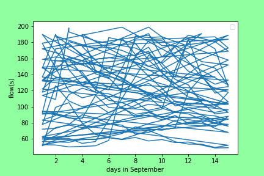
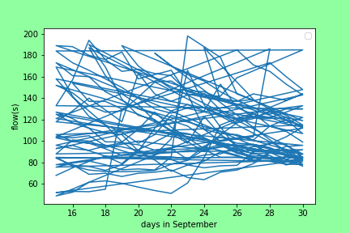
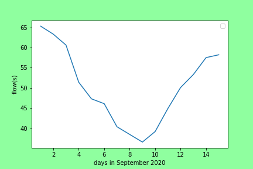
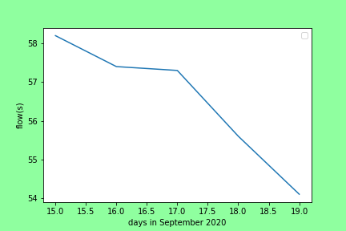
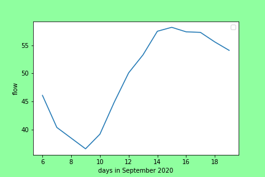
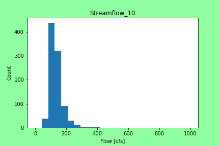
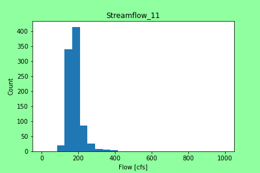
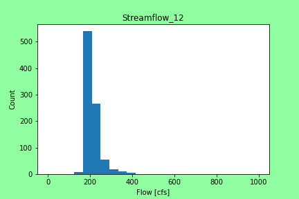

# Benjamin Mitchell
## `9/27/2020`
## Homework #5

___

# ***Grade***
___

___
### Table of Contents:
0. [ Grade](#grd)
1. [ Questions](#qns)
2. [ Discharge Estimation](#est)
3. [ Python Code(s)](#cod)
4. [ Appendices & Graphs](#apd)
5. [ Works Cited](#cit)

___

## Assignment Questions

##### The Python code used to answer the questions below can be found [here](../assignment_4/week4_questions_BM.py).

1. Provide a summary of the data frames properties.
- What are the column names?
- What is its index?
- What data types do each of the columns have?

**Ans:**
`(a) It is a 'Numpy Array'.
(b) The dtype is 'float64'.
(c) Its size is '46340' and its shape is '(11585, 4)'.
`

2. Provide a summary of the flow column including the min, mean, max, standard deviation and quartiles.

**Ans:**
`
`

3. Provide the same information but on a monthly basis. (Note: you should be able to do this with one or two lines of code)

**Ans:**
`
`

4. Provide a table with the 5 highest and 5 lowest flow values for the period of record. Include the date, month and flow values in your summary.

**Ans:**
`
`

5. Find the highest and lowest flow values for every month of the year (i.e. you will find 12 maxes and 12 mins) and report back what year these occurred in.

**Ans:**
`
`

`Some weird stuff right?  The first half is nothing, but that second half is fascinating.  It seems that on the 30th of September, the value center around 90 and 120, generally.  Interesting for future guesses is all.  I made some graphs just about this September too.  Not sure what you wanted here:
`

`It depends on how to slice the 1st and 2nd half, but at the beginning of September there was a trend downwards and then on the 9th there was a strong shift upwards do to a rainstorm.  This was followed by a trend back downwards and we seem to remain it in for now.
`

6. Provide a list of historical dates with flows that are within 10% of your week 1 forecast value. If there are none than increase the %10 window until you have at least one other value and report the date and the new window you used.

**Ans:**
`
`
___

## Estimation4 Explanation

For this weeks estimate (4), I decided to use and transform a prewritten python code using Visual Studio Code.  The python code section I wrote, allowed me to create serval histograms for all data under the flow of 400 and in the months September, October, November, and December.  By isolating this part of the total data ('flow_data'), I was able to run computations to make my predictions.  For my estimate, I took the mean of all the data in each month and also took the lowest value I could find in each months given histogram.  For example look at the chart below:

As you can see, in September, the smallest "bin" filled in with data is from 0 to 40.  I took the flow 40 as the first guess in the month of September, took 40 and averaged it with the mean for this month, 132.6.  This gives 86.3 and I used this for the two "middle" weeks of the month.  The final September guess was the mean or 132.6.  I did this for all months after this.  I thought since there is an average trend to be dry for a bit and then shoot up because of snowmelt, why not guess in a similar patter.  I am hopeful!

The graph below was used for my weekl1 and week2 guesses:

I was able to do some simple liner interpolation with the first three points trending downwards.

___

## My Python Code(s)4:

The Python Code, created in Visual Studio Code (VSC), can be found [here](../assignment_4/week4_numpy_starter_BM.py).  This python code was crafted from the original Starter code given [here](../Orig_Starter_Codes_BM/week4_numpy_starter.py).

___

## Appendices & Graphs
Here are all the charts created with my code:

___

## Works Cited:

[My estimate,](https://github.com/HAS-Tools-Fall2020/forecasting/blob/master/forecast_entries/mitchell.csv) given in row 5 of *mitchell.csv*, was estimated by the creation and application of the python code presented above.  The data used for this estimate was obtained via the USGS NWIS [mapper](https://maps.waterdata.usgs.gov/mapper/) for the gage number 09506000.
###### ~Thank you!
