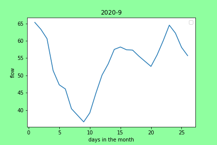

# Benjamin Mitchell
## `9/27/2020`
## Homework #5

___
<a name="grd"></a>
# ***Grade***
___


___
### Table of Contents:
0. [ Grade](#grd)
1. [ Questions](#qns)
2. [ Discharge Estimation](#est)
3. [ Python Code(s)](#cod)
4. [ Appendices & Graphs](#apd)
5. [ Works Cited](#cit)

___
<a name="qns"></a>
## Assignment Questions

##### The Python code used to answer the questions below can be found [here](../assignment_5/week5_questions_BM.py).

1. Provide a summary of the data frames properties.
- What are the column names?
- What is its index?
- What data types do each of the columns have?

**Ans:**
```
(a) agency_cd, site_no, datetime, flow, code, year, month, day.
(b) 0, 1, 2, 3, 4, 5, 6, 7
```

```python
# Question #1c

# type(data)
data.dtypes
```

**Output:**
```
(c)
agency_cd     object
site_no        int64
datetime      object
flow         float64
code          object
year           int32
month          int32
day            int32
dtype: object
```

2. Provide a summary of the flow column including the min, mean, max, standard deviation and quartiles.

```python
#Question #2

# data
# print(data)
# print(data[['datetime']])
flow = data["flow"]
# print(flow)
print('min:', '\n', flow.min())
print('mean:', '\n', flow.mean())
print('max:', '\n', flow.max())
print('std:', '\n', flow.std())
print('quantile:', '\n', flow.quantile())
# print(mean_data)

data['flow'].describe()
```

**Output:**
```
count    11592.000000
mean       345.630461
std       1410.832968
min         19.000000
25%         93.700000
50%        158.000000
75%        216.000000
max      63400.000000
Name: flow, dtype: float64
```

3. Provide the same information but on a monthly basis. (Note: you should be able to do this with one or two lines of code)

```python
# Question #3

# print(data)
# mon_flow = data[["month","flow"]]
# print(mon_flow)
# data["datetime":[2]]
# print('min:', '\n', data.min())
# data_test = data[(datetime[:,1]==9), 3]
# data["datetime"]
i=0
# print(range(len(data)))
# print(data.flow[data.month == (12)].describe())
for i in range(1, 13):
        # print(data['flow'])
        print(i)
        print(data.flow[data.month == (i)].describe())
```

**Output:**
```
1
count      992.000000
mean       706.320565
std       2749.153983
min        158.000000
25%        202.000000
50%        219.500000
75%        292.000000
max      63400.000000
Name: flow, dtype: float64
2
count      904.000000
mean       925.252212
std       3348.821197
min        136.000000
25%        201.000000
50%        244.000000
75%        631.000000
max      61000.000000
Name: flow, dtype: float64
3
count      992.000000
mean       941.731855
std       1645.803872
min         97.000000
25%        179.000000
50%        387.500000
75%       1060.000000
max      30500.000000
Name: flow, dtype: float64
4
count     960.000000
mean      301.240000
std       548.140912
min        64.900000
25%       112.000000
50%       142.000000
75%       214.500000
max      4690.000000
Name: flow, dtype: float64
5
count    992.000000
mean     105.442339
std       50.774743
min       46.000000
25%       77.975000
50%       92.950000
75%      118.000000
max      546.000000
Name: flow, dtype: float64
6
count    960.000000
mean      65.998958
std       28.966451
min       22.100000
25%       49.225000
50%       60.500000
75%       77.000000
max      481.000000
Name: flow, dtype: float64
7
count     992.000000
mean       95.571472
std        83.512343
min        19.000000
25%        53.000000
50%        70.900000
75%       110.000000
max      1040.000000
Name: flow, dtype: float64
8
count     992.000000
mean      164.354133
std       274.464099
min        29.600000
25%        76.075000
50%       114.000000
75%       170.250000
max      5360.000000
Name: flow, dtype: float64
9
count     956.000000
mean      172.688808
std       286.776478
min        36.600000
25%        88.075000
50%       120.000000
75%       171.250000
max      5590.000000
Name: flow, dtype: float64
10
count     961.000000
mean      146.168991
std       111.779072
min        69.900000
25%       107.000000
50%       125.000000
75%       153.000000
max      1910.000000
Name: flow, dtype: float64
11
count     930.000000
mean      205.105376
std       235.673534
min       117.000000
25%       156.000000
50%       175.000000
75%       199.000000
max      4600.000000
Name: flow, dtype: float64
12
count      961.000000
mean       337.097815
std       1097.280926
min        155.000000
25%        191.000000
50%        204.000000
75%        228.000000
max      28700.000000
Name: flow, dtype: float64
```

4. Provide a table with the 5 highest and 5 lowest flow values for the period of record. Include the date, month and flow values in your summary.

```python
# Question 4

# data[["datetime",'month', 'flow']]
# ind1 = data.flow.nlargest(5).index
# print(ind1)
# data[['datetime','month', 'flow'],ind1]
print(data.datetime[data.flow.nlargest(5).index])
print(data.month[data.flow.nlargest(5).index])
print(data.flow[data.flow.nlargest(5).index])

print(data.datetime[data.flow.nsmallest(5).index])
print(data.month[data.flow.nsmallest(5).index])
print(data.flow[data.flow.nsmallest(5).index])

# print(data.flow.nlargest(5))
# print(data.month[data.flow.nsmallest(5)])
# print(data.datetime[data['flow'].nsmallest(5)])
```

**Output:**
```
1468    1993-01-08
1511    1993-02-20
2236    1995-02-15
5886    2005-02-12
2255    1995-03-06
Name: datetime, dtype: object
1468    1
1511    2
2236    2
5886    2
2255    3
Name: month, dtype: int32
1468    63400.0
1511    61000.0
2236    45500.0
5886    35600.0
2255    30500.0
Name: flow, dtype: float64
8582    2012-07-01
8583    2012-07-02
8581    2012-06-30
8580    2012-06-29
8584    2012-07-03
Name: datetime, dtype: object
8582    7
8583    7
8581    6
8580    6
8584    7
Name: month, dtype: int32
8582    19.0
8583    20.1
8581    22.1
8580    22.5
8584    23.4
Name: flow, dtype: float64
```

5. Find the highest and lowest flow values for every month of the year (i.e. you will find 12 maxes and 12 mins) and report back what year these occurred in.

```python
# Question 5

for i in range(1, 13):
        print(i)
        print(data.flow[data.month == (i)].nlargest(1))
        print(data.year[data.flow[data.month == (i)].nlargest(1).index])

print('\n')

for i in range(1, 13):
        print(i)
        print(data.flow[data.month == (i)].nsmallest(1))
        print(data.year[data.flow[data.month == (i)].nsmallest(1).index])
```

**Output:**
```
1
1468    63400.0
Name: flow, dtype: float64
1468    1993
Name: year, dtype: int32
2
1511    61000.0
Name: flow, dtype: float64
1511    1993
Name: year, dtype: int32
3
2255    30500.0
Name: flow, dtype: float64
2255    1995
Name: year, dtype: int32
4
821    4690.0
Name: flow, dtype: float64
821    1991
Name: year, dtype: int32
5
1246    546.0
Name: flow, dtype: float64
1246    1992
Name: year, dtype: int32
6
1247    481.0
Name: flow, dtype: float64
1247    1992
Name: year, dtype: int32
7
6420    1040.0
Name: flow, dtype: float64
6420    2006
Name: year, dtype: int32
8
1330    5360.0
Name: flow, dtype: float64
1330    1992
Name: year, dtype: int32
9
5742    5590.0
Name: flow, dtype: float64
5742    2004
Name: year, dtype: int32
10
7949    1910.0
Name: flow, dtype: float64
7949    2010
Name: year, dtype: int32
11
5805    4600.0
Name: flow, dtype: float64
5805    2004
Name: year, dtype: int32
12
5842    28700.0
Name: flow, dtype: float64
5842    2004
Name: year, dtype: int32


1
5143    158.0
Name: flow, dtype: float64
5143    2003
Name: year, dtype: int32
2
783    136.0
Name: flow, dtype: float64
783    1991
Name: year, dtype: int32
3
83    97.0
Name: flow, dtype: float64
83    1989
Name: year, dtype: int32
4
10710    64.9
Name: flow, dtype: float64
10710    2018
Name: year, dtype: int32
5
5620    46.0
Name: flow, dtype: float64
5620    2004
Name: year, dtype: int32
6
8581    22.1
Name: flow, dtype: float64
8581    2012
Name: year, dtype: int32
7
8582    19.0
Name: flow, dtype: float64
8582    2012
Name: year, dtype: int32
8
11192    29.6
Name: flow, dtype: float64
11192    2019
Name: year, dtype: int32
9
11574    36.6
Name: flow, dtype: float64
11574    2020
Name: year, dtype: int32
10
8677    69.9
Name: flow, dtype: float64
8677    2012
Name: year, dtype: int32
11
10167    117.0
Name: flow, dtype: float64
10167    2016
Name: year, dtype: int32
12
8735    155.0
Name: flow, dtype: float64
8735    2012
Name: year, dtype: int32
```

6. Provide a list of historical dates with flows that are within 10% of your week 1 forecast value. If there are none than increase the %10 window until you have at least one other value and report the date and the new window you used.

```python
# Question 6
my_est = 104
ten_per = my_est*0.1
print(ten_per)
rnge = (my_est - ten_per, my_est + ten_per)
print(rnge)
print(rnge[0])

# print(data.datetime[data.flow >= rnge[0]])
# print(data.datetime[data.flow <= rnge[1]])

print(data.datetime[(data.flow >= rnge[0]) & (data.flow <= rnge[1])])
```

**Output:**
```
10.4
(93.6, 114.4)
93.6
81       1989-03-23
82       1989-03-24
83       1989-03-25
96       1989-04-07
97       1989-04-08
            ...    
11445    2020-05-03
11447    2020-05-05
11448    2020-05-06
11449    2020-05-07
11530    2020-07-27
Name: datetime, Length: 1071, dtype: object
```
___
<a name="est"></a>
## Estimation5 Explanation

For this weeks estimate (5), I decided to use a pandas data frames for my analysis.  My python code section,

allowed me to create serval histograms for all data under the flow of 400 and in the months September, October, November, and December.  By isolating this part of the total data ('flow_data'), I was able to run computations to make my predictions.  For my estimate, I took the mean of all the data in each month and also took the lowest value I could find in each months given histogram.  For example look at the chart below:


As you can see, in September, the smallest "bin" filled in with data is from 0 to 40.  I took the flow 40 as the first guess in the month of September, took 40 and averaged it with the mean for this month, 132.6.  This gives 86.3 and I used this for the two "middle" weeks of the month.  The final September guess was the mean or 132.6.  I did this for all months after this.  I thought since there is an average trend to be dry for a bit and then shoot up because of snowmelt, why not guess in a similar patter.  I am hopeful!

The graph below was used for my weekl1 and week2 guesses:



I gave my best guesses with the chart given.

___
<a name="cod"></a>
## My Python Code(s)4:

The Python Code, created in Visual Studio Code (VSC), can be found [here](../assignment_5/week5_pandas_starter_BM.py).  This python code was crafted from the original Starter code given [here](../Orig_Starter_Codes_BM/week5_pandas_starter.py).

___
<a name="apd"></a>
## Appendices & Graphs
Here are all the charts created with my code (there are a lot of them):


___
<a name="cit"></a>
## Works Cited:

[My estimate,](https://github.com/HAS-Tools-Fall2020/forecasting/blob/master/forecast_entries/mitchell.csv) given in row 5 of *mitchell.csv*, was estimated by the creation and application of the python code presented above.  The data used for this estimate was obtained via the USGS NWIS [mapper](https://maps.waterdata.usgs.gov/mapper/) for the gage number 09506000.
###### ~Thank you!
