# Benjamin Mitchell
## `10/4/2020`
## Homework #6

___
<a name="grd"></a>
### ***Grade***


___
### Table of Contents:
0. [ Grade](#grd)
1. [ Questions](#qns)
2. [ Discharge Estimation](#est)
3. [ Python Code(s)](#cod)
4. [ Appendices & Graphs](#apd)
5. [ Works Cited](#cit)

___
<a name="qns"></a>
## Assignment Questions

##### The Python code used to answer the questions below can be found [here](../assignment_6/week6_questions_BM.py).

###### Review the starter code I provided to see how to build an autoregressive(AR) model. Then build your own model, you can modify my model in any way for example changing the number of time steps used for prediction or changing the testing and training data periods. The only rule is that you must make some modifications to make the model your own.

###### For your written assignment provide the following. Your submission should include at least 3 different types of plots (see the note at the end of the previous section for how to add these into your markdown file if you are not sure how to do that):

1. A summary of the AR model that you ended up building, including (1) what you are using as your prediction variables, (2) the final equation for your model and (3) what you used as your testing and training periods. In your discussion please include graphical outputs that support why you made the decisions you did with your model.

**Ans:**
```

```

2. Provide an analysis of your final model performance. This should include at least one graph that shows the historical vs predicted streamflow and some discussion of qualitatively how you think your model is good or bad.

**Ans:**
```

```

3. Finally, provide discussion on what you actually used for your forecast. Did you use your AR model, why or why not? If not how did you generate your forecast this week?

**Ans:**
```

```

___
<a name="est"></a>
## Estimation5 Explanation

For this weeks estimate (5), I decided to use a pandas data frames for my analysis.  With my python code, I was able to pull out and plot all data from 2010 to August 2020.  I plotted all months using a for loop, first for the months that had 31 days (set_1) and then I plotted all months that had 30 days.  February was left out, but it was a month that was not important for my analysis.  I then looked a the trends of the same months, going from graph to graph.  For example, there was a trend in November of almost always increasing from the start of the month to the end of the month.  My estimations for November mirror this trend.  The graphs are plotting the flows for April, June, September, and November.  November is plotted via a red line so you may see the trend:

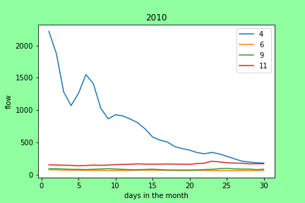

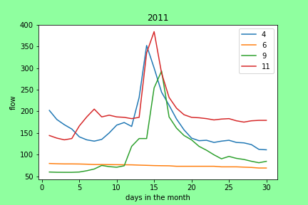


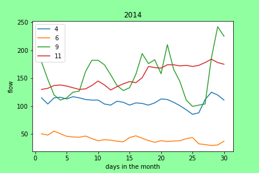

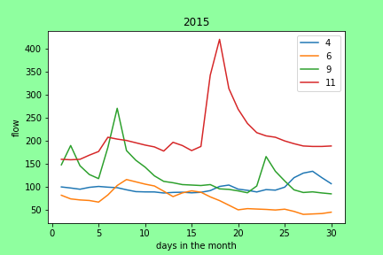

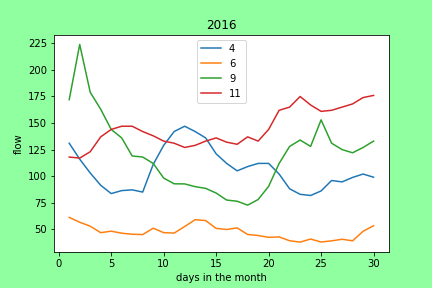

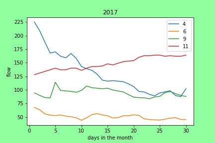


#### `The graph below was used for my weekl1 and week2 guesses:`


***I gave my best estimates with the chart given above.***

___
<a name="cod"></a>
## My Python Code(s)4:

The Python Code, created in Visual Studio Code (VSC), can be found [here](../assignment_5/week5_pandas_starter_BM.py).  This python code was crafted from the original Starter code given [here](../Orig_Starter_Codes_BM/week5_pandas_starter.py).

___
<a name="apd"></a>
## Appendices & Graphs
Here are all the charts created with my code (there are a lot of them):

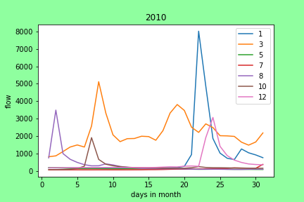


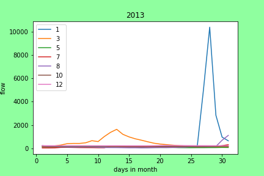

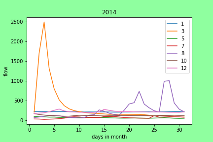


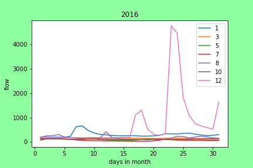

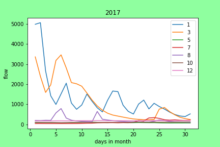


___
<a name="cit"></a>
## Works Cited:

[My estimate,](https://github.com/HAS-Tools-Fall2020/forecasting/blob/master/forecast_entries/mitchell.csv) given in row 5 of *mitchell.csv*, was estimated by the creation and application of the python code presented above.  The data used for this estimate was obtained via the USGS NWIS [mapper](https://maps.waterdata.usgs.gov/mapper/) for the gage number 09506000.
###### ~Thank you!
