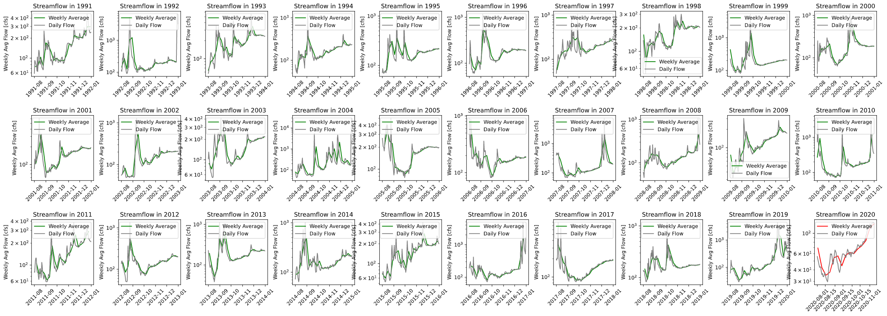
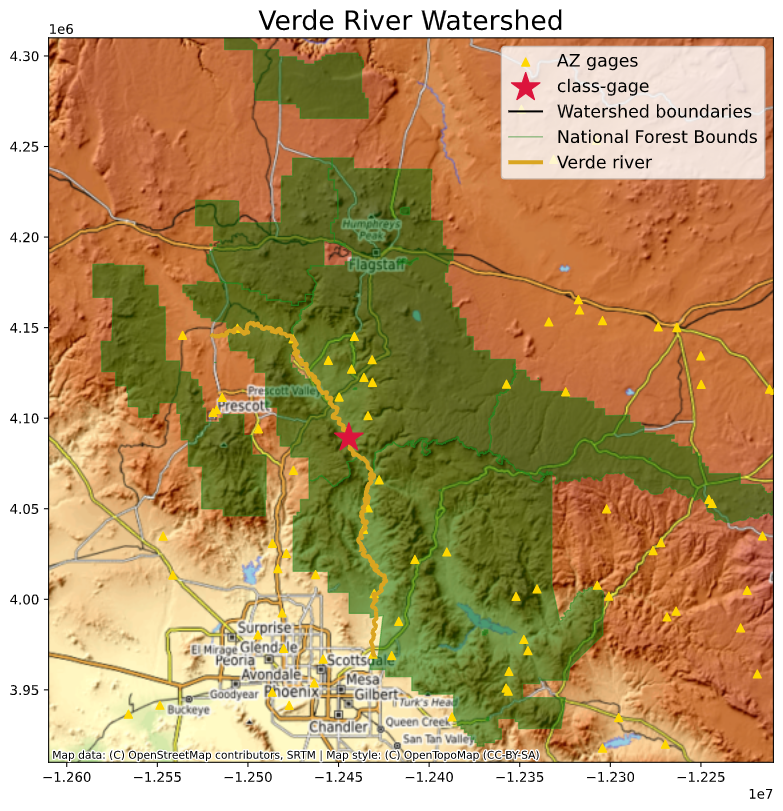

# Big Brain Team
## Lourdes Fierro, Adam Stratman, Patrick Neri, Benjamin Mitchell
### `11/08/2020`
### Group Homework #11

___

### ***Grade***

___
### Table of Contents:
0. [ Grade](#grd)
1. [ Questions](#qns)
2. [ Appendices & Graphs](#apd)

___

## Assignment Questions

1. The name of your team and the name of your team members

  **Ans:**
  `Check Top
  `

2. The one and two week forecast streamflow values for your teams

  **Ans:**
  `2020-11-09 (Week one): 130.977195
  `

  `2020-11-16 (Week one): 135.072142
  `

3. A brief summary of your collaboration. What did each team member bring to the table, who did what and how did you decide how to combine things?

  **Ans:**
  `Benjamin Mitchell worked one the autoregressive model and we   ended up using the log flow of that data to make are model.  Adam Stratman provided the script for the map image as well as conceptual framework for using a correction factor.  Patrick Neri contributed good vibes and assisted in the large plot of all the dry months flow values for the data set which can be found in the appendices.  Lourdes Fierro created the 16-week function using Ben's AR-model.  She also created a evel_functions.py for all of our functions to live.  She complied all separated python files into one '.py' file.  Also created a function to pull map data into the python file.
  `

4. A summary of your forecast. This should be written as a narrative summary without any blocks of code. It should summarize the inputs and approach used and must include at least 1 map and one graph. Only include graphs that you talk about in your narrative.

  **Ans:**
  `First off, we start by pulling the streamflow data from the USGS Website using a function.  Then we sort data by weekly flow and get the mean of the weeks.  Once we have this we can get the natural log for the data and throw it into our AR-model.  With our dataset organized to our needs, we define a training and testing period.  This will be sent through our autoregressive model.  The model is offset by one week.  For the two week flow predictions, we use the autoregressive (AR) models outputs directly.  For our 16 week flows, we use a 'Correction Factor' to better predict our flow values.
  `

  `Our full plots image is plotting the trends from July to January of the following year.  It uses the full data set from 1989 to 2019, plus whatever data is available for the year of 2020.  It uses a 'For' loop, along with 'if' & 'elseif' statements to graph all different year's data in one single image.  The image is given below:
  `

  `The map shows where the class stream gage is located.  It provides a good visual representation of the gage being inside a national forest boundaries.  This gage was selected because of the national forest location so that it is a free flowing river away from people.  This river is a tributary to the Salt River and ultimately to the Colorado River which is important to Tucson water!  It also shows other gages in the state of Arizona.  The map is pictured below:
  `

___

## Appendices & Graphs
Here are all the charts/ maps created with our code:

